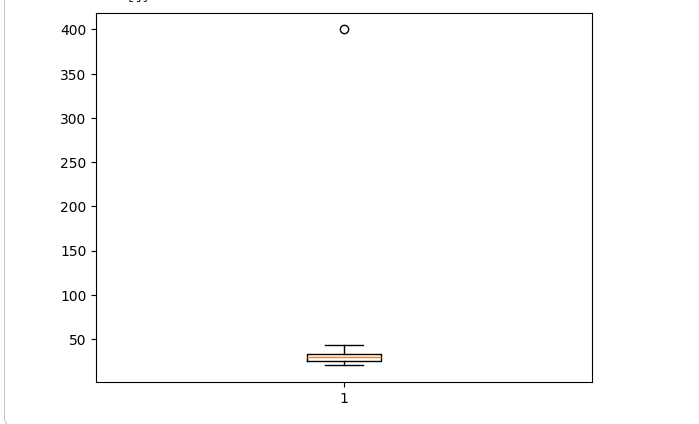
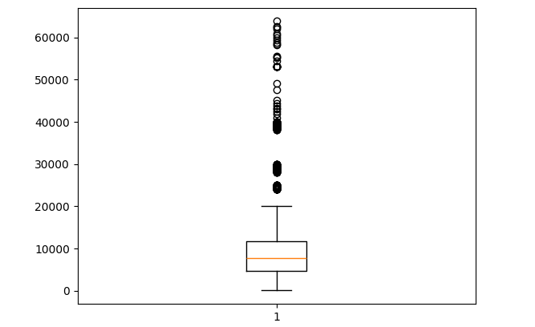
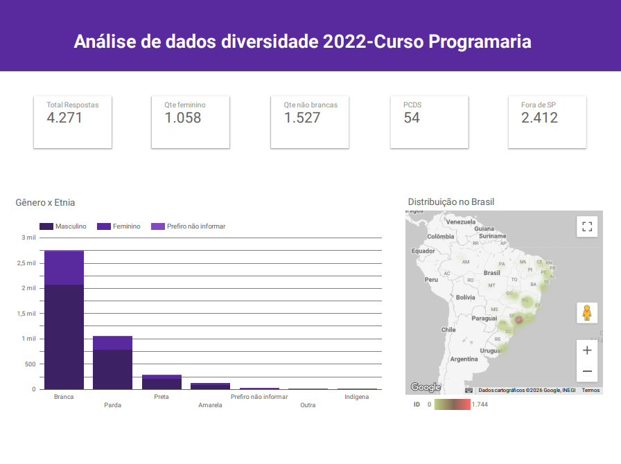

# Diversity in Technology in Brazil | Data Analysis

This project was developed during the **Python for Data Analysis** course by **PrograMaria**.

The project explores data related to diversity in the Brazilian technology market. The analysis examines demographic and professional characteristics, including gender, ethnicity, education level, seniority, salary, age group, and geographic distribution.

The goal was to use data to better understand representation in the technology field, identify patterns across different groups, and communicate the results through visualizations and an interactive dashboard.

---

## Project Objectives

* Explore a dataset related to diversity in the Brazilian technology market
* Clean and prepare data for analysis
* Identify patterns and relationships between demographic and professional variables
* Apply statistical concepts to support the analysis
* Create visualizations that make the results easier to understand
* Build an interactive dashboard in Looker Studio
* Practice SQL queries for data exploration
* Apply introductory machine learning concepts through linear regression

---

## Tools and Technologies

* **Python**
* **Google Colab**
* **Pandas**
* **NumPy**
* **Matplotlib**
* **SQL**
* **DBeaver**
* **Looker Studio**

---

## Skills Applied and Developed

Throughout this project, I practiced and developed skills in:

* Loading and exploring datasets with Python
* Data cleaning and transformation
* Working with missing values and inconsistent data
* Exploratory Data Analysis (EDA)
* Descriptive statistics
* Data visualization with Python
* Interpretation of charts and distributions
* Identification and analysis of outliers using boxplots
* SQL queries for filtering, sorting, grouping, and aggregating data
* Dashboard development in Looker Studio
* Introduction to machine learning concepts
* Linear regression practice using Python

---

## Analysis Process

### 1. Data Exploration and Preparation

The dataset was loaded and explored using Python in Google Colab. During this stage, the data was examined to understand its structure, available variables, possible inconsistencies, and missing values.

Data cleaning and transformation techniques were applied to prepare the dataset for further analysis.

### 2. Exploratory Data Analysis

Exploratory analysis was performed to investigate patterns in the data and better understand the profile of professionals represented in the dataset.

The analysis included comparisons involving:

* Gender and ethnicity
* Gender and education level
* Gender and seniority level
* Gender and average salary
* Ethnicity and education level
* Ethnicity and salary
* Ethnicity and region in Brazil
* Seniority level and ethnicity
* Age distribution

### 3. Statistics and Data Visualization

Statistical concepts were applied to summarize and interpret the data. Different visualizations were created to make patterns, distributions, comparisons, and possible outliers easier to identify.

Boxplots were used to analyze age distribution and identify potential outliers in the dataset.

### 4. SQL Practice

SQL was used in DBeaver to explore and query the dataset.

The activities included practice with:

* `SELECT` statements
* Filtering data with `WHERE`
* Sorting results with `ORDER BY`
* Grouping data with `GROUP BY`
* Aggregations such as `COUNT`, `AVG`, `MIN`, and `MAX`
* Exploratory queries to support the analysis

### 5. Dashboard Development

An interactive dashboard was created in Looker Studio to present the main results of the analysis.

The dashboard allows the exploration of diversity indicators through demographic, educational, geographic, and professional perspectives.

---
## Project Highlights

The visualizations below highlight key stages of the analysis process. They were selected because they helped investigate data quality, understand the distribution of relevant variables, identify potential outliers, and support deeper analysis of demographic and professional patterns in the dataset.

Rather than serving only as visual outputs, these charts were used to guide decisions throughout the project, including the validation of inconsistent values and the investigation of salary variation across different groups.

## Key Visualizations

The visualizations below were created during the exploratory data analysis stage. They were used to understand the distribution of important variables, identify unusual values, and support decisions about data quality and further analysis.

### Age Distribution and Data Quality Check

  

This boxplot represents the distribution of ages among the professionals included in the dataset.

It was used to identify the central range of ages, the spread of the data, and possible outliers. The chart highlights one value close to 400 years old, which is not realistic and may indicate a data entry error.

This finding was important because it showed the need to validate age-related data before using it in calculations, summaries, or visualizations. Identifying potential inconsistencies is an essential part of the data cleaning and preparation process.

### Salary Distribution and Outlier Analysis

  

This boxplot represents the salary distribution of professionals in the dataset.

It was used to understand the concentration and variation of salary values, as well as to identify values that are significantly higher than most observations. Most salaries are concentrated in a lower range, while several higher salary values appear as outliers.

Unlike the age outlier, high salary values are not automatically considered errors. They may represent senior professionals, management positions, specialized roles, or companies with higher salary ranges.

This visualization supported further analysis of salary differences by gender, ethnicity, education level, and seniority level.

---

## Interactive Dashboard

  

[Click here to access the interactive Looker Studio dashboard](https://datastudio.google.com/reporting/dd4e921d-bf47-49ba-80ae-2b55ddb68c0a)
An interactive dashboard was developed in Looker Studio to consolidate the main findings from the analysis into a clear and accessible visual format.

The dashboard presents an overview of diversity in the Brazilian technology market and allows users to explore the data through different demographic and professional perspectives.

The dashboard includes indicators and visualizations related to:

* Total number of responses in the dataset
* Gender distribution
* Ethnic and racial representation
* Geographic distribution across Brazil
* Education level by gender
* Seniority level by gender
* Average salary by gender
* Gender and ethnicity comparisons
* Education level by ethnicity
* Salary differences by ethnicity
* Ethnicity by region in Brazil
* Seniority level by ethnicity
* Age group filtering

The purpose of the dashboard was to transform the analysis into a tool that supports exploration and communication of results. Instead of presenting only isolated charts, it brings the main variables together and makes it easier to compare groups, identify patterns, and investigate diversity indicators.

The dashboard also allows users to filter the information by age group, making it possible to explore how diversity indicators may change across different age ranges.

## Course

Project developed as part of the **Python for Data Analysis** course by **PrograMaria**.

This repository was created to document the learning process and showcase practical skills in data analysis, SQL, data visualization, dashboards, statistics, and introductory machine learning.
